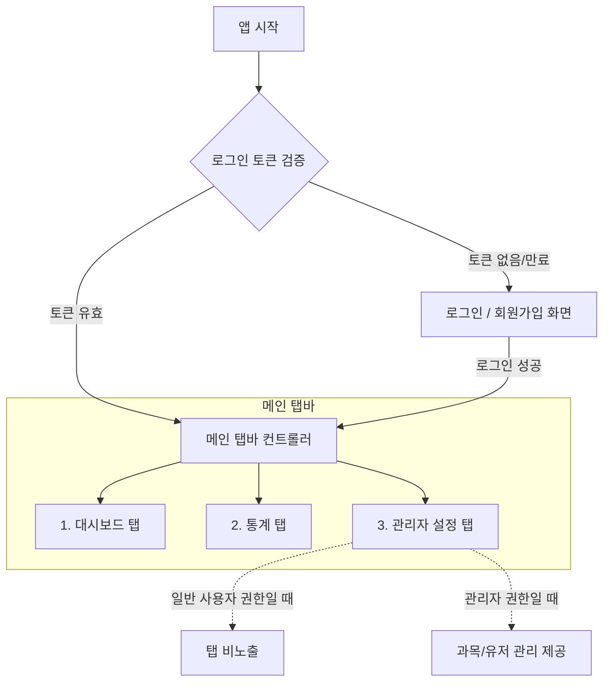

# PPakong Timer - iOS Application Specification

본 문서는 공부 시간 측정 및 관리 서비스인 'PPaking Timer'의 iOS 네이티브 애플리케이션 개발을 위한 종합 사양서(Specification)입니다. 본 사양서만 참고하여도 추가적인 질문 없이 완성도 높은 앱을 구현할 수 있도록 디자인 시스템, 화면 흐름, 핵심 로직 및 백엔드 API 규격을 상세히 정의합니다.

---

## 1. 기본 원칙 및 시간 처리 규칙 (Critical)

서버와 클라이언트 간의 시간 불일치 및 오차 문제를 방지하기 위해 다음 원칙을 반드시 준수하여 개발해야 합니다.

### 1.1 표준 시간대 및 포맷
- 모든 API 통신 시 날짜와 시간 정보는 **ISO 8601 UTC** 형식을 기준으로 송수신합니다.
- 예: `2026-06-30T00:06:44.000Z`
- 앱 내에서 서버로 날짜 필드를 보낼 때는 항상 UTC 기준으로 변환된 ISO 8601 문자열을 전달하며, 서버로부터 받은 ISO 8601 문자열은 클라이언트의 로컬 시간대로 파싱하여 화면에 표시합니다.

### 1.2 통계용 날짜 경계 정의
- 특정 날짜(예: 오늘)의 통계를 서버에 요청할 때, **사용자 기기의 로컬 타임존 기준**으로 해당 날짜의 시작(`00:00:00.000`)과 끝(`23:59:59.999`)을 먼저 정의합니다.
- 정의된 로컬 날짜 경계 시간을 **ISO 8601 UTC 문자열로 변환**한 뒤, API의 `startDate` 및 `endDate` 파라미터로 전송합니다.
  - *예시 (한국 표준시 KST, UTC+9 기준)*:
    - 사용자가 선택한 기준일: `2026-06-30`
    - 로컬 시작 시각: `2026-06-30 00:00:00.000 KST` -> UTC 변환: `2026-06-29T15:00:00.000Z` (`startDate`)
    - 로컬 종료 시각: `2026-06-30 23:59:59.999 KST` -> UTC 변환: `2026-06-30T14:59:59.999Z` (`endDate`)

---

## 2. 디자인 시스템 및 테마 가이드

모던하고 고급스러운 디자인(Premium Design)을 구현하기 위해 다음 테마 컬러셋과 스타일을 준수합니다. 앱은 사용자의 시스템 설정 또는 앱 내 수동 설정을 통해 **라이트 모드(Light Mode)**와 **다크 모드(Dark Mode)**를 완벽히 지원해야 합니다.

### 2.1 테마 컬러 정의
| 구분 | 라이트 모드 (Hex Code) | 다크 모드 (Hex Code) | 비고 |
| :--- | :--- | :--- | :--- |
| **배경색 (Background)** | `#F8F9FA` | `#1A1B1E` | 전체 화면의 기본 배경 |
| **카드 배경 (Card BG)** | `#FFFFFF` | `#25262B` | 섹션, 폼, 목록 등의 컨테이너 배경 |
| **텍스트 (Primary Text)** | `#212529` | `#C1C2C5` | 헤더 및 주요 텍스트 |
| **텍스트 (Secondary)** | `#6C757D` | `#909296` | 서브 텍스트, 라벨, 설명 등 |
| **주요 색상 (Primary)** | `#4DABF7` | `#339AF0` | 브랜드 키 컬러 (하늘색 계열) |
| **주요 색상 호버/강조** | `#339AF0` | `#4DABF7` | 활성화 또는 터치 시 피드백 컬러 |
| **경계선 (Border)** | `#DEE2E6` | `#373A40` | 분할선, 텍스트 필드 테두리 |
| **성공/시작 (Success)** | `#51CF66` | `#51CF66` | 공부 시작 버튼, 성공 피드백 |
| **위험/중지 (Danger)** | `#FF6B6B` | `#FF6B6B` | 공부 종료 버튼, 삭제 버튼 |

### 2.2 타이포그래피
- 기본 시스템 서체 활용 또는 **Pretendard** 폰트를 내장하여 적용합니다.
- 화면 내 제목은 Semi-Bold 또는 Bold를 활용하고, 본문 텍스트는 Regular 또는 Medium을 적용하여 가독성을 높입니다.

---

## 3. 로컬 데이터 보존 규격 (Local Storage)

기기의 UserDefaults 또는 보안이 필요한 데이터는 Keychain을 사용하여 로컬에 보관합니다.

| 저장 데이터 Key | 저장 공간 | 데이터 타입 | 설명 |
| :--- | :--- | :--- | :--- |
| `study_token` | Keychain 또는 UserDefaults | String | API 인증용 JWT 토큰 |
| `saved_current_page` | UserDefaults | String | 마지막에 머물렀던 탭 이름 (`dashboard`, `stats`, `admin`) |
| `saved_home_subject_id` | UserDefaults | Int | 대시보드 화면에서 마지막으로 선택했던 과목 ID |
| `saved_stats_subject_id` | UserDefaults | Int | 통계 화면에서 마지막으로 선택했던 필터 과목 ID |
| `saved_stats_date` | UserDefaults | String | 통계 화면에서 마지막으로 선택했던 기준 날짜 (`YYYY-MM-DD`) |
| `last_stats_date_change` | UserDefaults | Double | 사용자가 통계 날짜를 수동으로 변경한 시점의 Unix Timestamp |
| `theme_setting` | UserDefaults | String | 테마 설정 값 (`light`, `dark`, `system`) |

### 3.1 통계 날짜 자동 리셋 규칙 (5분 유예 정책)
- 사용자가 통계 날짜 필터(`saved_stats_date`)를 오늘 이외의 날짜로 변경하면 변경 시각(`last_stats_date_change`)을 기록합니다.
- 이후 통계 화면에 다시 진입할 때, 현재 시각과 `last_stats_date_change`의 시간 차이를 비교합니다.
  - 시간 차이가 **5분(300초)을 초과**한 경우: 기준 날짜를 자동으로 '오늘 날짜'로 초기화하고 저장소를 갱신합니다.
  - 시간 차이가 **5분 이내**인 경우: 저장된 날짜(`saved_stats_date`)를 그대로 유지하여 보여줍니다.

---

## 4. 화면 구조 및 네비게이션 흐름 (UX Flow)



### 4.1 로그인 / 회원가입 화면 (Auth View)
- **화면 목적**: 사용자가 서비스에 접속하기 위한 계정 인증 및 생성 단계입니다.
- **UI 구성**:
  - 앱 타이틀 ("PPaking Timer") 및 서브타이틀
  - Segmented Control (로그인 / 회원가입 전환)
  - 아이디(Username) 입력 필드 (영문/숫자 제한, 텍스트 자동완성 비활성화)
  - 비밀번호(Password) 입력 필드 (Secure Text Entry)
  - 제출 버튼 (로그인 또는 회원가입 처리)
- **비즈니스 로직**:
  - **로그인 시**: `POST /api/auth/login` 호출 -> 성공 시 토큰을 로컬에 저장하고 `GET /api/auth/verify`를 호출하여 사용자 정보를 받아온 뒤 메인 화면으로 이동합니다.
  - **회원가입 시**: `POST /api/auth/register` 호출 -> 성공 시 "회원가입이 완료되었습니다. 로그인해 주세요." 알림창을 띄우고 로그인 탭으로 자동 전환합니다.
  - **자동 로그인**: 앱이 기동할 때 로컬에 `study_token`이 존재하면 즉시 `GET /api/auth/verify`를 호출하여 검증합니다. 성공 시 즉시 메인 화면으로 진입하며, 실패 시 토큰을 지우고 로그인 화면을 표시합니다.

---

### 4.2 메인 탭바 컨트롤러 (Main TabBar)
- **1번 탭 (대시보드)**: 타이머 측정 및 오늘의 누적 통계 간략 표시.
- **2번 탭 (통계)**: 24시간 원형 차트 및 기간별 상세 공부 분석.
- **3번 탭 (관리자)**: 과목 추가/수정/삭제 및 사용자 추가/삭제 (로그인한 사용자의 `role`이 `'admin'`인 경우에만 탭바에 노출).

---

### 4.3 대시보드 화면 (Dashboard View)
- **화면 목적**: 선택한 과목에 대한 공부 시간을 실시간으로 측정합니다.

```
+------------------------------------------+
| 오늘의 공부                               |
|                                          |
|                01:23:45                  |
|             [ 타이머 디스플레이 ]           |
|                                          |
|  +------------------+ +---------------+  |
|  | 오늘 총 공부      | | 오늘 과목 공부 |  |
|  | 3시간 12분 5초    | | 1시간 23분 45초|  |
|  +------------------+ +---------------+  |
+------------------------------------------+
|  공부할 과목                               |
|  [ 수학                       v ]        |
|                                          |
|  [         수학 공부 종료          ]      |
+------------------------------------------+
```

- **UI 구성**:
  - **타이머 디스플레이**: `HH:mm:ss` 형식의 라벨. 공부 중이 아닐 때는 `00:00:00`으로 고정됩니다.
  - **오늘 총 공부 카드**: 오늘 전체 과목의 누적 공부 시간을 `X시간 Y분 Z초` 포맷으로 실시간 갱신합니다.
  - **오늘 과목 공부 카드**: 과목이 선택되었을 때만 표시되며, 해당 과목의 오늘 누적 공부 시간을 실시간 갱신합니다. 과목 미선택 시 Hidden 처리합니다.
  - **과목 선택 (Picker)**: 공부를 시작할 과목 리스트를 불러와 드롭다운 형태로 노출합니다.
  - **토글 버튼 (Button)**: 과목을 선택하지 않았을 때는 비활성화("과목을 선택하세요") 상태입니다. 과목이 선택되면 활성화("X 과목 공부 시작", 초록색 배경)되며, 공부 중인 상태에서는 빨간색 배경의 "X 공부 종료"로 변경됩니다. 공부 중인 상태에서는 과목 선택 Picker가 비활성화(disabled)되어 변경할 수 없습니다.
  - **오늘의 공부 계획 섹션**:
    - **계획 추가 폼**: 텍스트 입력창(계획 내용), 10분 단위의 시간 슬라이더(10~60분) 및 숫자 입력 필드가 연동되어 표시됩니다. 상단 과목 Picker에서 과목을 선택했을 때만 계획 추가 버튼이 활성화됩니다.
    - **계획 목록**: 오늘 등록된 계획 카드가 세로 목록으로 렌더링됩니다. 각 카드는 과목의 테마 컬러가 입혀진 테두리와 칩이 제공됩니다.
    - **진행 상황 막대 (Progress Bar)**: 계획의 목표 대비 현재 진행 상황을 백분율로 채워주는 막대 그래프가 렌더링되며, 목표 시간을 도달하는 지점에 붉은색 마커가 함께 렌더링됩니다.
    - **진행률 및 마커 실시간 초과 로직**: 공부 누적 시간이 목표치를 넘어서서 계속 공부를 진행할 경우, 현재 공부 누적 시간이 막대의 100%가 되며, 원래 목표 시간 지점은 100%보다 왼쪽으로 비율에 따라 당겨지며(상대적으로 짧아지며) 렌더링됩니다.
    - **계획 액션 버튼**:
      - 공부가 진행 중이지 않은 계획: "시작" 및 "완료" 버튼 노출. (시작 누르면 해당 계획 세션 시작, 완료 누르면 'done' 상태 전환 및 취소선 표시)
      - 현재 공부 중인 계획: "정지" 버튼 노출 (애니메이션 탑재).
      - 각 계획 공통: "삭제" 버튼 노출.
- **핵심 비즈니스 로직**:
  - **상태 동기화 (`checkActiveSession`)**: 화면 진입 시 `GET /api/study/status`를 호출하여 현재 서버 상에서 측정 중인 세션이 있는지 검증합니다.
    - 진행 중인 세션이 있고 `plan_id`가 지정되어 있다면: 선택 과목을 해당 과목 ID로 고정하고, `start_time`을 기준으로 iOS 로컬 타이머를 구동하며, 해당 계획 카드의 누적 시간 및 진행률 바를 1초 단위로 실시간 증가시킵니다.
  - **타이머 시작**: 과목 선택 후 시작 클릭 시 `POST /api/study/start` (body: `{ subject_id, plan_id }`) 호출 -> 성공 시 로컬 타이머 구동을 개시합니다.
  - **타이머 종료**: 종료 클릭 시 `POST /api/study/stop` 호출 -> 성공 시 로컬 타이머를 정지하고 누적 시간을 최신화하며 계획 목록을 다시 조회하여 정확한 시간이 누적되도록 합니다.
  - **계획 중복 공부 제한**: 계획 카드의 "시작" 클릭 시 이미 타이머가 돌아가고 있다면, 기존 진행 중인 세션을 종료하고 새 계획 세션을 시작할지 물어보는 확인 대화창을 표시합니다.
  - **iOS 백그라운드 전환 대응**:
    - 앱이 백그라운드로 전환되거나 기기가 대기 모드로 들어가면 로컬 타이머가 멈출 수 있습니다.
    - 이에 대응하기 위해 앱이 포그라운드로 돌아오는 시점에 `GET /api/study/status`를 재호출하여 세션 진행 여부 및 시작 시각(`start_time`), `plan_id`를 동기화하여 타이머 및 계획 진행 표시 화면을 정렬해야 합니다.


---

### 4.4 통계 화면 (Stats View)
- **화면 목적**: 선택한 일자의 공부 분포를 24시간 원형 시계 차트로 시각화하고 요약 정보를 제공합니다.
- **UI 구성**:
  - **사용자 선택 Picker**: 로그인한 사용자가 관리자(`admin`)인 경우에만 노출되며, 다른 사용자의 통계를 선택하여 볼 수 있습니다. 일반 사용자는 이 컨테이너 자체가 숨겨집니다.
  - **날짜 필터**: '이전 날짜(◀) / DatePicker(YYYY-MM-DD) / 다음 날짜(▶)' 네비게이션 바로 구성됩니다. 미래의 날짜를 선택할 수 없도록 '다음 날짜' 버튼 및 DatePicker의 최대 날짜는 '오늘'로 제한합니다.
  - **과목 필터 (Picker)**: 특정 과목만 필터링하여 통계를 볼 수 있는 옵션 제공 ("모든 과목" 선택 항목 포함).
  - **24시간 원형 시계 차트**: 24시간을 나타내는 360도 파이 차트입니다. (상세 구현은 하단 5절 참조)
  - **시간 요약 리스트**:
    - 선택일 총 공부시간: `X시간 Y분 Z초`
    - 최근 7일 합계
    - 최근 30일 합계
    - 주간 일평균 (최근 7일 합계 / 7)
    - 월간 일평균 (최근 30일 합계 / 30)
  - **과목별 공부 시간 범례 (List)**: 선택한 일자에 공부한 과목별 명칭, 고유 색상 원형 뱃지, 과목별 총 누적 합산 시간을 목록으로 표현합니다.
- **핵심 비즈니스 로직**:
  - **실시간 시간 보정 (중요)**:
    - 사용자가 조회하고 있는 통계 날짜가 '오늘'이고, 현재 공부가 진행 중(Active Session)인 경우, 화면상의 요약 시간과 과목 범례 시간에 실시간 경과 시간(`elapsed`)을 가산하여 1초마다 동적으로 텍스트를 업데이트해야 합니다.
    - 정밀한 동기화를 위해, 통계 화면이 활성화된 상태에서는 **1초 주기**로 UI 텍스트(실시간 누적치 가산)를 업데이트하고, **60초 주기**로 서버 API(`GET /api/study/stats`)를 재호출하여 전체 데이터를 백그라운드 동기화합니다.

---

### 4.5 관리자 화면 (Admin View)
- **화면 목적**: 시스템에 등록된 전체 사용자 계정 및 공부 과목군을 관리합니다. (관리자 권한 필수)
- **UI 구성**:
  - **과목 관리 카드**:
    - 새 과목 추가 폼: 컬러 픽커(Color Picker), 텍스트 입력 필드(과목명), '추가' 버튼
    - 등록된 과목 리스트: 각 과목별 컬러뷰, 과목명 텍스트필드(수정 가능), '수정' 버튼, '삭제' 버튼
  - **사용자 관리 카드**:
    - 새 사용자 추가 폼: 아이디 입력 필드, 비밀번호 입력 필드, 역할 선택 드롭다운(일반 사용자/관리자), '추가' 버튼
    - 등록된 사용자 리스트: 아이디(역할) 텍스트 라벨, 본인 이외의 사용자에 대해 우측에 '삭제' 버튼 제공
- **핵심 비즈니스 로직**:
  - 추가/수정/삭제 액션 실행 시 관리자 API 엔드포인트를 적절히 호출하고, 완료 성공 얼럿을 노출한 뒤 리스트 데이터를 다시 불러와 갱신합니다.

---

## 5. 24시간 원형 시계 차트 상세 렌더링 명세

통계 화면의 핵심 시각화 요소인 **24시간 원형 차트**는 24시간(1,440분)을 360도 원그래프에 매핑하여 하루의 공부 일과를 직관적으로 파악하게 만드는 시계형 차트입니다. 네이티브 그래픽 프레임워크(SwiftUI Canvas, UIKit Core Graphics 등)를 사용해 커스텀 렌더링해야 합니다.

### 5.1 데이터 분할 및 맵핑 규칙
1. **각도 환산**: 하루 24시간 = 1,440분 = 360도. 즉, **1분당 0.25도(degree)**의 각도를 가집니다.
2. **시작 기준점**: 시계의 12시 방향(Top)은 **오전 00:00 (0A)**을 나타내며, 시계 방향으로 시간이 흐릅니다.
   - 수학적 삼각함수 기준으로는 12시 방향이 `-90도` 또는 `270도`에 해당하므로 렌더링 시 오프셋 설정에 유의합니다.
3. **세션 조각(Slice) 구성**:
   - 서버로부터 받아온 해당 일자의 공부 세션 목록(`sessions`)을 시작 시간 순으로 정렬합니다.
   - 하루의 시작 시각인 **오전 00:00:00 (Local Time)**부터 **오후 23:59:59.999 (Local Time)**까지 전체 1,440분을 촘촘하게 채워 조각 리스트를 생성합니다.
   - 세션 사이에 비어있는 시간은 **'빈 시간(Empty Gap)' 조각**으로 처리하여 투명도가 가미된 배경색으로 채웁니다.
     - *빈 시간 조각 색상*: `rgba(233, 236, 239, 0.2)`
   - 공부가 진행된 시간은 세션 정보에 정의된 고유의 과목 색상(Hex Code)으로 채웁니다.
   - 진행 중인 세션(Active Session)의 종료 시점은 현재 시간(또는 하루의 끝)으로 동적 계산하여 조각을 완성합니다.

### 5.2 시계 문자판 가이드 (Clock Labels)
- 차트 원형의 바깥 둘레에 일정한 마진(예: 15pt)을 두고, **24시간 눈금 레이블**을 시계 방향으로 배치합니다.
- 배치 레이블 규칙 (총 24개):
  - 0시(12시 방향): `0A`
  - 1시 ~ 11시: `1A` ~ `11A`
  - 12시(6시 방향): `MD` (Mid-day)
  - 13시 ~ 23시: `1P` ~ `11P`
- 레이블은 디바이스 테마에 맞는 텍스트 컬러(Primary Text)로 렌더링합니다.

### 5.3 Active 세션 강조 애니메이션 (Conic Gradient)
- 현재 실시간으로 공부가 측정되고 있는 활성화 세션 조각(`is_active == true`)의 경우, 정적인 단색 대신 **부드럽게 회전하며 흐르는 듯한 콘익 그라데이션(Conic Gradient) 애니메이션**을 적용합니다.
- **그라데이션 설계**:
  - 해당 과목의 기본 색상(`baseColor`)을 기조로 하되, 특정 구간(예: 중심부 5% 범위)에 반투명한 흰색 하이라이트(`rgba(255, 255, 255, 0.5)`)를 섞어 그라데이션을 구성합니다.
  - *예시 배색 구조*: `[baseColor -> baseColor -> Highlight(White) -> baseColor -> baseColor]`
- **애니메이션 메커니즘**:
  - 디스플레이 링크(CADisplayLink 또는 SwiftUI TimelineView)를 활용해 그라데이션의 시작 각도 오프셋(`gradientOffset`)을 매 프레임마다 미세하게 가산(예: 프레임당 `+0.05` rad)하여 시계 방향으로 빛이 도는 효과를 구현합니다.
  - 활성화된 세션이 없을 때는 회전 애니메이션 루프를 중지하여 기기 배터리 소모를 최소화합니다.

---

## 6. 백엔드 API 연동 명세

모든 API 요청의 Base URL은 환경 변수로 정의할 수 있어야 합니다. (예: `https://seainthebottle.mooo.com/api`)
*주의*: 웹페이지 주소(`https://seainthebottle.mooo.com/summer`)의 서브 디렉토리인 `/summer` 경로가 Base URL 중간에 들어가지 않아야 합니다. 아파치 리버스 프록시 설정에 의해 API 요청은 `/api/...`로 바로 도달해야 정상 동작합니다.

### 6.1 공통 통신 헤더
API 요청 시 HTTP Header에 다음 항목을 공통적으로 적용해야 합니다.
```http
Content-Type: application/json
Authorization: Bearer <study_token> (토큰이 기기에 저장되어 있는 경우 필수 포함)
```

---

### 6.2 인증 관련 API (Auth)

#### 6.2.1 로그인 (POST `/auth/login`)
- **Body**:
  ```json
  {
    "username": "user_id_here",
    "password": "user_password_here"
  }
  ```
- **Response (200 OK)**:
  ```json
  {
    "token": "eyJhbGciOiJIUzI1NiIsIn...",
    "user": {
      "id": 1,
      "username": "user_id_here",
      "role": "user" // 'user' 또는 'admin'
    }
  }
  ```

#### 6.2.2 회원가입 (POST `/auth/register`)
- **Body**:
  ```json
  {
    "username": "new_user_id",
    "password": "new_password"
  }
  ```
- **Response (200 OK)**:
  ```json
  {
    "user": {
      "id": 2,
      "username": "new_user_id",
      "role": "user"
    }
  }
  ```

#### 6.2.3 토큰 유효성 검증 (GET `/auth/verify`)
- **Response (200 OK)**:
  ```json
  {
    "user": {
      "id": 1,
      "username": "user_id_here",
      "role": "user"
    }
  }
  ```

---

### 6.3 공부 제어 및 통계 API (Study)

#### 6.3.1 전체 과목 리스트 조회 (GET `/study/subjects`)
- **Response (200 OK)**:
  ```json
  [
    { "id": 1, "name": "국어", "color": "#ff6b6b" },
    { "id": 2, "name": "수학", "color": "#339af0" }
  ]
  ```

#### 6.3.2 공부 시작 (POST `/study/start`)
- **Body**:
  ```json
  {
    "subject_id": 2,
    "plan_id": 12 // (선택) 계획 공부 연동 시 계획 ID 전달
  }
  ```
- **Response (200 OK)**:
  ```json
  {
    "success": true,
    "session": {
      "id": 15,
      "user_id": 1,
      "subject_id": 2,
      "plan_id": 12,
      "start_time": "2026-06-30T00:10:00.000Z",
      "end_time": null
    }
  }
  ```

#### 6.3.3 공부 종료 (POST `/study/stop`)
- **Response (200 OK)**:
  ```json
  {
    "success": true,
    "session": {
      "id": 15,
      "user_id": 1,
      "subject_id": 2,
      "start_time": "2026-06-30T00:10:00.000Z",
      "end_time": "2026-06-30T01:30:00.000Z"
    }
  }
  ```

#### 6.3.4 현재 공부 상태 조회 (GET `/study/status`)
- **Response (200 OK - 공부 중인 세션이 있을 때)**:
  ```json
  {
    "active": {
      "id": 15,
      "subject_id": 2,
      "plan_id": 12,
      "start_time": "2026-06-30T00:10:00.000Z"
    }
  }
  ```
- **Response (200 OK - 공부 중인 세션이 없을 때)**:
  ```json
  {
    "active": null
  }
  ```


#### 6.3.5 공부 통계 데이터 조회 (GET `/study/stats`)
- **Query Parameters**:
  - `targetUserId`: (선택) 조회할 대상 사용자의 식별자 ID (관리자용)
  - `startDate`: (필수) 조회 시작 시간 범위 (ISO 8601 UTC)
  - `endDate`: (필수) 조회 종료 시간 범위 (ISO 8601 UTC)
  - `subjectId`: (선택) 특정 과목만 필터하여 조회하고자 할 때의 과목 ID
- **Response (200 OK)**:
  ```json
  {
    "dailyTotal": 5400,   // 선택일 총 공부 시간 (단위: 초)
    "weeklyTotal": 37800, // 최근 7일간 합산 공부 시간 (단위: 초)
    "monthlyTotal": 162000, // 최근 30일간 합산 공부 시간 (단위: 초)
    "sessions": [
      {
        "id": 14,
        "subject_name": "국어",
        "color": "#ff6b6b",
        "start": "2026-06-30T00:10:00.000Z",
        "end": "2026-06-30T01:30:00.000Z",
        "is_active": false
      },
      {
        "id": 15,
        "subject_name": "수학",
        "color": "#339af0",
        "start": "2026-06-30T03:00:00.000Z",
        "end": "2026-06-30T03:40:00.000Z",
        "is_active": true
      }
    ]
  }
  ```

#### 6.3.6 공부 계획 리스트 조회 (GET `/study/plans`)
- **Response (200 OK)**:
  ```json
  [
    {
      "id": 1,
      "user_id": 2,
      "subject_id": 2,
      "title": "Solve 10 Math Problems",
      "estimated_minutes": 40,
      "completed_seconds": 1800,
      "status": "todo",
      "created_at": "2026-07-08T12:00:00.000Z",
      "subject_name": "수학",
      "subject_color": "#339af0"
    }
  ]
  ```

#### 6.3.7 공부 계획 생성 (POST `/study/plans`)
- **Body**:
  ```json
  {
    "subject_id": 2,
    "title": "Solve 10 Math Problems",
    "estimated_minutes": 40
  }
  ```
- **Response (200 OK)**:
  ```json
  { "success": true }
  ```

#### 6.3.8 공부 계획 완료 처리 (POST `/study/plans/{id}/done`)
- **Response (200 OK)**:
  ```json
  { "success": true }
  ```

#### 6.3.9 공부 계획 삭제 (DELETE `/study/plans/{id}`)
- **Response (200 OK)**:
  ```json
  { "success": true }
  ```

---

### 6.4 관리자 전용 API (Admin)


#### 6.4.1 전체 사용자 리스트 조회 (GET `/admin/users`)
- **Response (200 OK)**:
  ```json
  [
    { "id": 1, "username": "admin_user", "role": "admin" },
    { "id": 2, "username": "normal_user", "role": "user" }
  ]
  ```

#### 6.4.2 신규 사용자 등록 (POST `/admin/users`)
- **Body**:
  ```json
  {
    "username": "new_student",
    "password": "student_password",
    "role": "user" // 'user' 또는 'admin'
  }
  ```
- **Response (200 OK)**:
  ```json
  { "success": true }
  ```

#### 6.4.3 사용자 계정 삭제 (DELETE `/admin/users/{userId}`)
- **Response (200 OK)**:
  ```json
  { "success": true }
  ```

#### 6.4.4 신규 공부 과목 추가 (POST `/admin/subjects`)
- **Body**:
  ```json
  {
    "name": "외국어",
    "color": "#e03131"
  }
  ```
- **Response (200 OK)**:
  ```json
  { "success": true, "id": 5 }
  ```

#### 6.4.5 기존 공부 과목 수정 (PUT `/admin/subjects/{id}`)
- **Body**:
  ```json
  {
    "name": "영어독해",
    "color": "#c2255c"
  }
  ```
- **Response (200 OK)**:
  ```json
  { "success": true }
  ```

#### 6.4.6 공부 과목 삭제 (DELETE `/admin/subjects/{id}`)
- **Response (200 OK)**:
  ```json
  { "success": true }
  ```

---

## 7. iOS 환경 구현 고려사항 (Tips for Developer)

1. **디바이스 로컬 타임존 처리**:
   - `Calendar` 및 `DateFormatter` 사용 시 타임존을 명확히 명시해야 오차를 방지할 수 있습니다. 특히 UTC 변환 및 로컬 변환이 교차하는 부분의 로직 검증이 필수적입니다.
2. **SwiftUI / UIKit 네비게이션 복원**:
   - 앱 종료 전 `saved_current_page` 탭 상태를 로컬 저장하여 재구동 시 해당 화면을 기본 탭으로 로드하면 모던한 웹의 경험을 그대로 모바일에서 구현할 수 있습니다.
3. **네트워크 예외 처리**:
   - 오프라인 상태이거나 네트워크 타임아웃 발생 시 다이얼로그 안내 및 재시도 로직을 설계하고, 토큰 만료 에러(`401 Unauthorized`) 발생 시 로컬 세션을 강제 종료하고 로그인 화면으로 전환되도록 Global API Interceptor 구조를 갖추는 것을 권장합니다.
